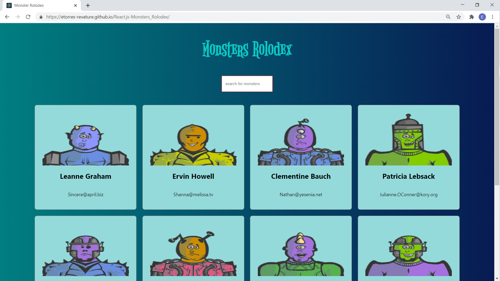
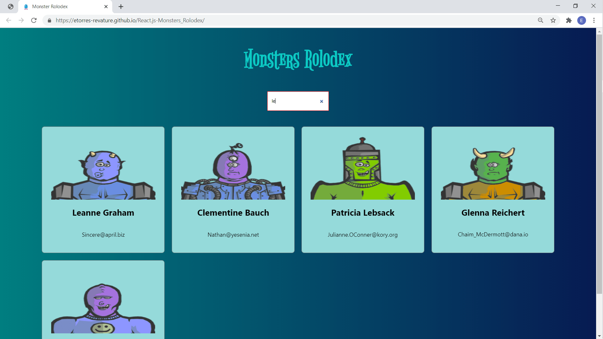

# React.js Monsters Rolodex

## Project Description

This project is a sample of the React.js library and its component functionality.  There are two api calls to get user names and monster pictures.  Those pictures are rendered on functional components created in React.js.  There is alos a search functionality created through the React.js class-based component. 

## Table of Contents

* [Title](#project-title)
* [Description](#project-description)
* [Table of Contents](#table-of-contents)
* [Installation](#installation-instructions)
* [Usage](#usage)
* [Contributing](#guidelines-for-contributing)
* [Tests](#tests)
* [Technologies](#technologies-used)
* [Author](#author)
* [Questions](#questions)
* [License](#license)

## Installation Instructions

[Monsters Rolodex is deployed to GitHub Pages](https://etorres-revature.github.io/React.js-Monsters_Rolodex/).

## Usage 

[Monsters Rolodex](https://etorres-revature.github.io/React.js-Monsters_Rolodex/) is comprised of ten monsters whose names are pulled from the [{JSON} Placeholder users API](https://jsonplaceholder.typicode.com/) and whose pictures are form the [ROBOHASH API](https://robohash.org/).

The [Monsters Rolodex](https://etorres-revature.github.io/React.js-Monsters_Rolodex/) app exists in the class-based component giving it access to the State object.  The monster cards are rendered through functional components, which gain access to the State object through the "props" (short for properties)object argument.

[Monsters Rolodex](https://etorres-revature.github.io/React.js-Monsters_Rolodex/) also features a filtering function.  Users can type information into the input, and the app will display only those monsters with the input letters in their name.

## Guidelines for Contributing

Please send thoughts and suggestions for further improvements to the e-mail address listed below.

## Tests

Test early; test often.

### Technologies Used 
### :computer: :computer: :computer: :computer: :computer: :computer: 

#### :memo: HTML5 :memo:

**JavaScript (JS)** is one of the core technologies of the World Wide Web (along with HTML and CSS). It enables interactive web pages and is an essential part of web applications.  JS is a multi-faceted, scripting language that provides versatility through Application Programming Interfaces (APIs) and Document Object Model (DOM) manipulation, among others.

*JavaScript* content borrowed from <a target="_blank" rel="noopener noreferrer">[this page](https://en.wikipedia.org/wiki/JavaScript).</a>

**NODE.js** is an open-source, cross-platform JavaScript runtime environment that execute JavaScript code outside a web browser.  NODE.js lets developers use JavaScript to write command line tools and for server-side scripting.  NODE.js represents a "Javascript everywhere" paradigm, unifying web-application development around a single programming language, rather than different programming languages for server- and client-side scripts.  

*NODE.js* content borrowed from <a target="_blank" rel="noopener noreferrer">[this page](https://en.wikipedia.org/wiki/Node.js).</a>

[Download Node.js](https://nodejs.org/en/).

#### :satellite: Express.js :satellite:

**Express.js** is a minimal and flexible NODE.js web application framework that provides a robust set of features for web and mobile applications.  The myriad HTTP utility methods and middleware allow for the creation of a robust API.  Express.js provides a thin layer of fundamental features, without obscuring NODE.js features.

*Express.js* content borrowed from <a target="_blank" rel="noopener noreferrer">[this page](https://expressjs.com/).</a>

### :vertical_traffic_light: React.js :vertical_traffic_light:

**React.js** is an open-source, front-end, JavaScript library for building user interface components. React.js can be used as a base in the development of single-page or mobile applications.  It is only concerned with rendering data to the DOM.

*React.js* content borrowed from <a target="_blank" rel="noopener noreferrer">[this page](https://en.wikipedia.org/wiki/React).</a>

### Author 

This *React.js Monsters Rolodex* was built by :green_heart: Eric D. Torres :green_heart:

## Questions

Check out my [GitHub profile](https://github.com/etorres-revature).

You can contact me by e-mail at etorresnotary@gmail.com for any additional questions and/ or clarifications you may need about the project.

##### License

[This application uses the **MIT License** found here](./LICENSE).

**[This README.md file generated with my NODE.js README Generator app.](https://github.com/etorres-revature/NODEjs_README.md_Generator)**
